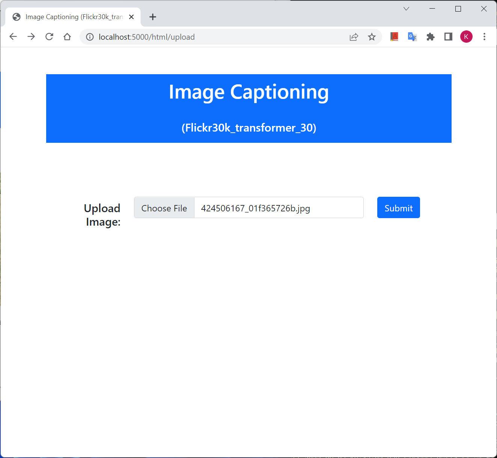
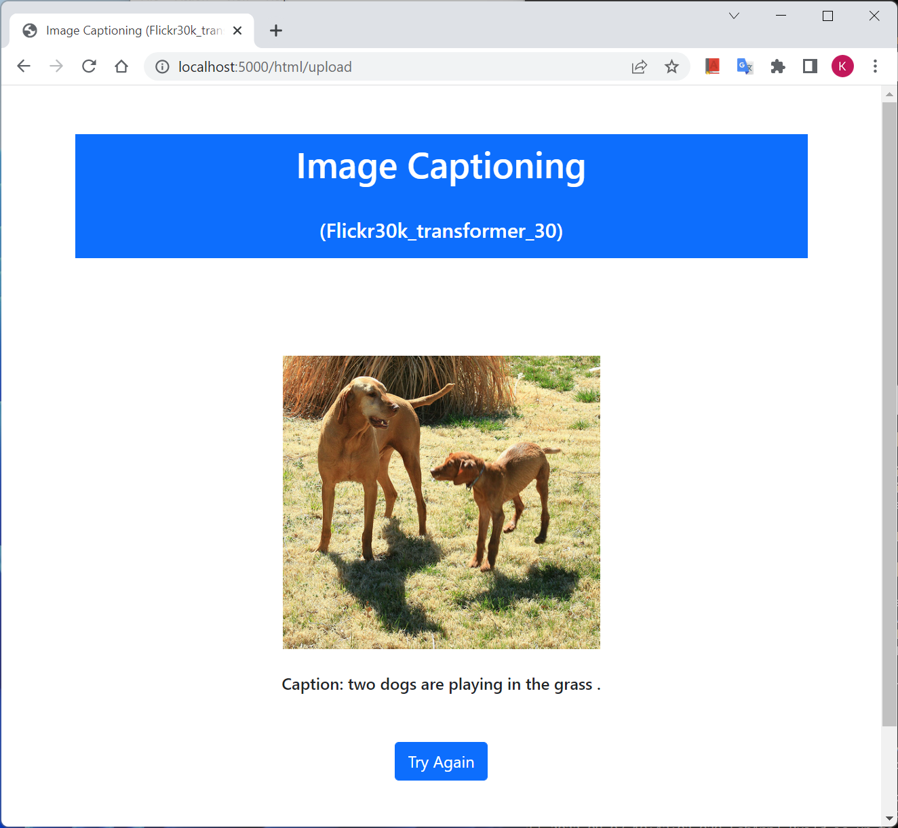
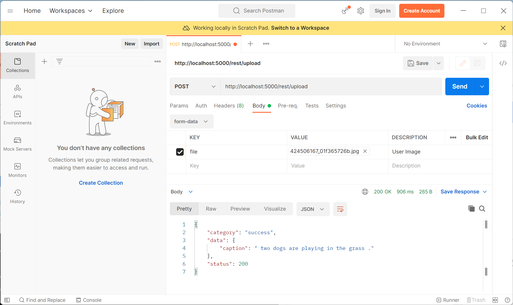

# Image Captioning
This project is mainly composed of two parts. The first is the model training and best model selection, and the second part is the deployment.

You can find the detail procedures about the model training/selection in the 'icap' subdirectory. The README.md file in the directory explains data preparation, model training, prediction and evaluation using the convenient ***icap_tool***.

According to the evaluation result, the ***transformer*** model shows the best performance overall, so the ***"transformer model with epoch-30"*** will be used in the deployment.

For the deployment, you don't need all the output files from the previous stage. You just need those info such as model weights, vocabulary info, and pre-trained embedding matrix. Here's the files you need for the deployment.

<pre>
C:\ICapProduction\icap\workspace
│   Flickr30k-caption_sequence_info.pkl
│   Flickr30k-embedding_matrix_fasttext.pkl
│   Flickr30k-vocab.pkl
│
└───Flickr30k-transformer_model
        checkpoint
        ckpt-30.data-00000-of-00001
        ckpt-30.index
</pre>

## Run the service
There are two ways to run the service - ***Native mode*** and ***Docker container mode***.

Both modes are leveraging the ***Flask*** framework and provide Web interface and REST API.

Here's an example to start the service on Windows 11 Powershell environment.
<pre>
PS C:\ICapProduction\deployment> $Env:ICAP_DIR = "C:\ICapProduction\icap"
PS C:\ICapProduction\deployment> .\windows-run.bat
</pre>

or

<pre>
PS C:\ICapProduction\deployment> $Env:ICAP_DIR = "C:\ICapProduction\icap"
PS C:\ICapProduction\deployment> .\docker-run.bat
</pre>

## Web Interface
* **Request:** Connect to ```http://<service_url>/html/upload```

<br><br>

* **Reposnse**<br>


## REST API
* **CURL:** Connect to ```http://<service_url>/rest/upload```<br>
<pre>
$ curl -F 'file=@./424506167_01f365726b.jpg' localhost:5000/rest/upload
{
  "category": "success",
  "data": {
    "caption": " two dogs are playing in the grass ."
  },
  "status": 200
}
</pre>
<br>

* **Postman:** Connect to ```http://<service_url>/rest/upload```<br>
