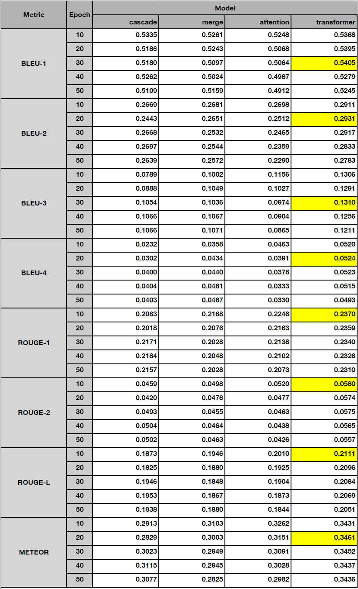

# 1. Data Preparation

**Install kaggle tool and download the image dataset** 
>`$ export DATASET_DIR='./data/Flickr30k_dataset'` 
>`$ pip install kaggle` 
>`$ kaggle datasets download -d hsankesara/flickr-image-dataset -p ${DATASET_DIR}`

 

**Unzip data** 
>`$ (cd ${DATASET_DIR}; unzip -q flickr-image-dataset.zip)`

 

**Data cleanup** 
The original dataset has duplicate image directory and results.csv
>`$ rm -f  ${DATASET_DIR}/flickr30k_images/flickr30k_images/results.csv` 
>`$ rm -rf ${DATASET_DIR}/flickr30k_images/flickr30k_images/flickr30k_images`

The results.csv file has a mal-formed line where one delimiter is missing. 
>`Wrong:   "2199200615.jpg| 4   A dog runs across the grass ."` 
>`Correct: "2199200615.jpg| 4|  A dog runs across the grass ."` 
>`$ sed 's/2199200615.jpg| 4   A dog runs across the grass ./2199200615.jpg| 4| A dog runs across the grass ./g' ${DATASET_DIR}/flickr30k_images/results.csv > ${DATASET_DIR}/flickr30k_images/results_fixed.csv`

 

**Pre-trained word vectors** 
Download the file an unzip.
https://dl.fbaipublicfiles.com/fasttext/vectors-english/wiki-news-300d-1M.vec.zip
  

**The data directory will look like this:** 
<pre>
ICapProduction/icap
  └── data
      ├── wiki-news-300d-1M.vec
      └── Flickr30k_dataset
          ├── flickr-image-dataset.zip --> this file can be remove.
          └── flickr30k_images
              ├── flickr30k_images
              │   ├── 99679241.jpg
              │   ├── more than 30,000 jpg images
              │   └── ......
              ├── results.csv --> this file can be removed.
              └── results_fixed.csv
</pre>

# 2. The icap_tool
**icap_tool** is command line utility that provides training, prediction and evaluation of various models with differnt data scales.
<pre>
Usage: icap_tool.py [OPTIONS] COMMAND [ARGS]...

Options:
  --help  Show this message and exit.

Commands:
  evaluate
  predict
  train
</pre>

**'Train' subcommand** 
<pre>
Usage: icap_tool.py train [OPTIONS]

Options:
  -d, --dataset TEXT  Dataset name  [default: Flickr30k]
  -m, --models TEXT   List of models  [default:
                      transformer,attention,merge,cascade]
  -e, --epochs TEXT   Save weights after given number of epochs  [default:
                      10,20,30,40,50]
  --help              Show this message and exit.
</pre>

1) Dataset selection 
By default, the command will use full 30k images of Flickr30k dataset and split it into 80% train set and 20% test set. 
Howevever, you can use part of the data for a quick run. For example, "-d Flickr30k_8000_0.8" option will use only 8000 images with 80%:20% split for train and test respectively.

2) Model selection 
There are 4 models available. cascaded_encoder_decoder, merged_encoder_decoder, encoder_decoder_with_attention, encoder_decoder_with_transformer. 
You can select single model, or multiple models separated by comma without space. For example, "-m transformer,merge" will run training for the merge model and the transformer model.

3) Epoch selection 
Number of epochs can be specified, then at the end of the given epochs, train weights will be saved for later use in prediction and evaluation. For example, "-e 30,50,100" will run total 100 epochs and at the end of 30, 50 and 100 epochs, the weights will be saved.

 

**'Predict' subcommand** 
<pre>
Usage: icap_tool.py predict [OPTIONS]

Options:
  -d, --dataset TEXT   Dataset name  [default: Flickr30k]
  -m, --models TEXT    List of models  [default:
                       transformer,attention,merge,cascade]
  -e, --epochs TEXT    Load pretrained weights after given number of epochs
                       [default: 10,20,30,40,50]
  -n, --count INTEGER  Number of images to predict. (0 means all test images)
                       [default: 0]
  --help               Show this message and exit.
</pre>

Predict command will generation captions for the test images using the pre-trained weights by the 'train' command above. You can specify the dataset, models and epochs in the same way as the 'train' command.
The generated captions will be saved to files and used for evaluation later.

 

**'Evaluate' subcommand** 
<pre>
Usage: icap_tool.py evaluate [OPTIONS]

Options:
  -d, --dataset TEXT  Dataset name  [default: Flickr30k]
  -m, --models TEXT   List of models  [default:
                      transformer,attention,merge,cascade]
  -e, --epochs TEXT   Load pretrained weights after given number of epochs
                      [default: 10,20,30,40,50]
  -c, --consolidate   Create consolidated evaluation table
  --help              Show this message and exit.
</pre>

Evaluate command will calculate the BLEU, ROUGE and METEOR scores, comparing the captions generated by the trained models and the reference texts given with the original images.
The evaluation scores will be saved to files per-model and per-epoch.
The '-c' option will average out each individual evaluation results and consolidate in a single file.

# 3. Run training, prediction and evaluation

**Training**
<pre>
python .\icap_tool.py train -d Flickr30k -m transformer,attention,merge,cascade -e 10,20,30,40,50
</pre>

**Prediction**
<pre>
python .\icap_tool.py predict -d Flickr30k -m transformer,attention,merge,cascade -e 10,20,30,40,50
</pre>

**Evaluation**
<pre>
python .\icap_tool.py evaluate -d Flickr30k -m transformer,attention,merge,cascade -e 10,20,30,40,50
python .\icap_tool.py evaluate -c -d Flickr30k -m transformer,attention,merge,cascade -e 10,20,30,40,50
</pre>

# 4. Output files
Output files will be generated in './workspace' directory and the structure will look like this:
<pre>
.\workspace
|   Flickr30k-vocab.pkl                     => Vocabulary DB
|   Flickr30k-embedding_matrix_fasttext.pkl => Pretrained embedding matrix using Fasttext
|   Flickr30k-caption_sequences.pkl         => Word sequence for training data
|   Flickr30k-caption_sequence_info.pkl     => Metadata for caption sequences
|
+---Flickr30k-vgg16-include_top
|       ......
|       Image features extracted via pre-trained VGG16 model
|       (For cascade and merge models)
|
+---Flickr30k-vgg16-no_include_top
|       ......
|       Image features extracted via pre-trained VGG16 model
|       (for attention and transformer models)
|
+---Flickr30k-attention_model
|       checkpoint
|       ckpt-10.data-00000-of-00001 => saved weights after 10 epochs
|       ckpt-10.index
|       ckpt-20.data-00000-of-00001 => saved weights after 20 epochs
|       ckpt-20.index
|       ckpt-30.data-00000-of-00001 => saved weights after 30 epochs
|       ckpt-30.index
|       ckpt-40.data-00000-of-00001 => saved weights after 40 epochs
|       ckpt-40.index
|       ckpt-50.data-00000-of-00001 => saved weights after 50 epochs
|       ckpt-50.index
|       predictions-10.json  => prediction result after 10 epochs
|       predictions-20.json  => prediction result after 20 epochs
|       predictions-30.json  => prediction result after 30 epochs
|       predictions-40.json  => prediction result after 40 epochs
|       predictions-50.json  => prediction result after 50 epochs
|       eval_scores-10.csv   => evaluation scores after 10 epochs
|       eval_scores-20.csv   => evaluation scores after 20 epochs
|       eval_scores-30.csv   => evaluation scores after 30 epochs
|       eval_scores-40.csv   => evaluation scores after 40 epochs
|       eval_scores-50.csv   => evaluation scores after 50 epochs
|
+---Flickr30k-cascade_model
|       ........
|       checkpoint, eval_scores, predictions data ... for cascade model
|
+---Flickr30k-merge_model
|       ........
|       checkpoint, eval_scores, predictions data ... for merge model
|
+---Flickr30k-transformer_model
|       ........
|       checkpoint, eval_scores, predictions data ... for transformer model
|
\---Flickr30k-eval.csv ==> Consolidated evaluation result
</pre>

# 5. Evaluation Result

As shown in the picture, the transformer model shows the best overall performance at 20-30 training epochs.

